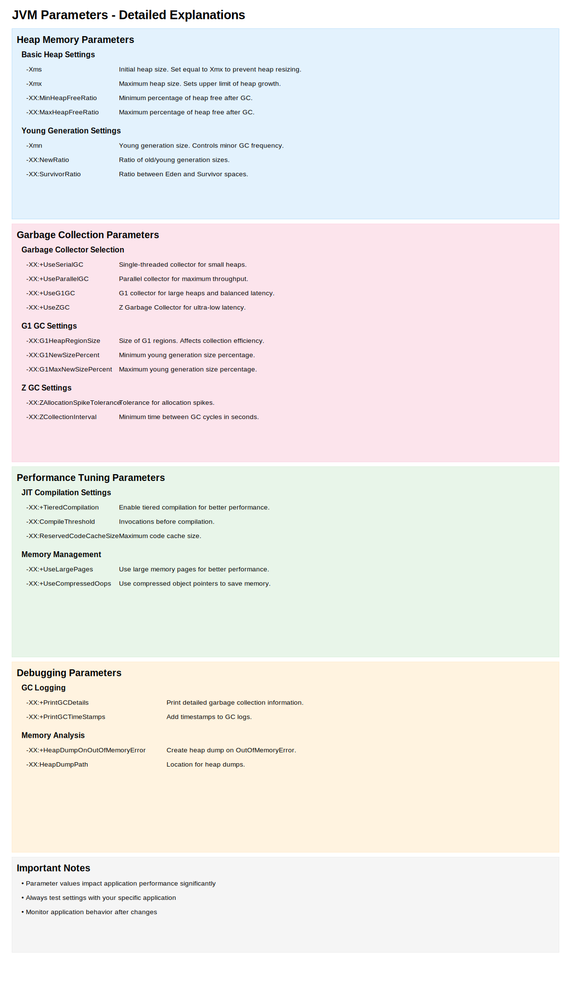

<link rel="stylesheet" href="assets/css/custom.css">

# JVM Areas

# JVM Areas Interaction

# JVM Architecture

# JVM Parameters

# JVM Performance Tuning

# JVM Trading Configurations

# Architettura Completa della Java Virtual Machine (JVM)

## 1. Class Loading Subsystem

### Load
- **Bootstrap Class Loader**
  - Implementato in codice nativo (C/C++)
  - Carica le classi fondamentali da rt.jar (java.lang.Object, String, ecc.)
  - Non visibile alle applicazioni Java (restituisce null da `ClassLoader.getBootstrapClassLoader()`)
  - Principio di delega: ha la massima priorità

- **Extension Class Loader** (`sun.misc.Launcher$ExtClassLoader`)
  - Carica estensioni standard di Java da jre/lib/ext/
  - Gestisce librerie come JDBC, XML, crittografia
  - Figlio del Bootstrap Class Loader

- **Application Class Loader** (`sun.misc.Launcher$AppClassLoader`)
  - Carica classi dell'applicazione dal CLASSPATH o module path
  - Utilizzato per caricare il tuo codice applicativo
  - Figlio dell'Extension Class Loader
  - Può essere esteso per classi di caricamento personalizzate

### Link
- **Verify**
  - Controlla il formato del file .class
  - Verifica l'integrità dello stack e dei tipi
  - Assicura che il bytecode non violi le regole di sicurezza
  - Può essere disabilitato con `-Xverify:none` (sconsigliato)

- **Prepare**
  - Alloca memoria per variabili statiche
  - Inizializza ai valori predefiniti:
    - Numerici: 0
    - Boolean: false
    - Reference: null
  - Non esegue ancora il codice di inizializzazione

- **Resolve**
  - Sostituisce i riferimenti simbolici con riferimenti diretti
  - Risolve riferimenti al constant pool
  - Può essere eseguito eager (subito) o lazy (quando necessario)

### Initialize
- **Static Variables Initialization**
  - Esegue l'inizializzazione esplicita delle variabili statiche
  - Assegna i valori dichiarati nel codice sorgente

- **Execute Static Blocks**
  - Esegue i blocchi `static { ... }`
  - Segue l'ordine di dichiarazione nel codice
  - Utile per logica di inizializzazione complessa

## 2. Runtime Data Areas

### Heap Memory (`-Xms`, `-Xmx`)
Il garbage collector opera principalmente qui.

- **Young Generation**
  - **Eden Space**
    - Allocazione iniziale per quasi tutti i nuovi oggetti
    - Dimensionabile con `-XX:NewSize`, `-XX:MaxNewSize`
    - Dopo la GC, gli oggetti sopravvissuti vanno nei Survivor Spaces

  - **Survivor Spaces (S0 e S1)**
    - Due aree identiche, una sempre vuota dopo la GC
    - Gli oggetti si spostano tra S0 e S1
    - Configurabili con `-XX:SurvivorRatio` (rapporto Eden:Survivor)
    - Parametro "tenuring threshold" (`-XX:MaxTenuringThreshold`): numero di cicli GC prima di promuovere un oggetto all'Old Generation

- **Old Generation (Tenured)**
  - Contiene oggetti "longevi"
  - GC meno frequente ma più costosa
  - Può essere ottimizzata per vari algoritmi GC
  - Può causare pause lunghe se piena

### Non-Heap Memory

- **Metaspace**
  - Introdotto in Java 8 (sostituisce PermGen)
  - Risiede nello spazio di memoria nativo
  - Memorizza:
    - Class loaders
    - Metadata delle classi
    - Metodi e costanti
    - Annotazioni
  - Configurabile con `-XX:MetaspaceSize`, `-XX:MaxMetaspaceSize`
  - Cresce dinamicamente se non limitato

- **Code Cache**
  - Contiene codice nativo compilato dal JIT
  - Limitato da `-XX:InitialCodeCacheSize`, `-XX:ReservedCodeCacheSize`
  - Se pieno, può disabilitare ulteriori compilazioni JIT
  - JVM restituisce warning quando è al 85% di utilizzo

- **Direct Memory (NIO)**
  - Utilizzata da ByteBuffer.allocateDirect()
  - Bypassando l'heap Java migliora I/O performance
  - Controllabile con `-XX:MaxDirectMemorySize`
  - Non gestita dal garbage collector standard
  - Liberata solo quando il relativo ByteBuffer viene raccolto dal GC

## 3. Thread Areas (`-Xss`)

- **Thread Stack**
  - Dimensione per thread configurabile con `-Xss`
  - Ogni thread ha il proprio stack
  - Structure:
    - **Local Variables**: Primitive e riferimenti
    - **Operand Stack**: Per calcoli intermedi
    - **Frame Data**:
      - Constant pool reference
      - Exception table
      - Return address

- **PC Registers (Program Counter)**
  - Un registro per thread
  - Contiene indirizzo dell'istruzione corrente
  - Per metodi nativi contiene un valore undefined

- **Native Method Stack**
  - Per chiamate a metodi nativi (JNI)
  - Implementata in C/C++ stack
  - Configurabile con `-Xoss` (obsoleto in molte JVM)

## 4. Execution Engine

- **Interpreter**
  - Traduce bytecode in istruzioni macchina
  - Esecuzione linea per linea
  - Semplice ma relativamente lento
  - Utilizzato per tutto il codice inizialmente

- **JIT Compiler**
  - **Client Compiler (C1)**: Ottimizzazioni rapide, meno aggressive
  - **Server Compiler (C2)**: Ottimizzazioni più profonde
  - **Tiered Compilation**: Usa entrambi (default da Java 8)
    1. Interpretazione
    2. Compilazione C1 semplice
    3. Compilazione C1 con profiling
    4. Compilazione C2 ottimizzata
  - Ricompilazione adattiva basata su statistiche runtime

- **Hotspot Profiler**
  - Identifica "hot spots" (codice frequentemente eseguito)
  - Raccoglie dati su:
    - Conteggio chiamate metodi
    - Branch behavior
    - Tipi effettivi degli oggetti
  - Dati utilizzati per ottimizzazioni JIT

- **Garbage Collector**
  - **Algoritmi disponibili**:
    - **Serial**: Un thread, pause del mondo
    - **Parallel**: Multi-thread per GC, pause del mondo
    - **CMS** (Concurrent Mark Sweep): Minimizza pause
    - **G1** (Garbage First): Bilanciamento tra throughput e pause
    - **ZGC**: Per heap molto grandi, pause < 10ms
    - **Shenandoah**: Simile a ZGC
  - Selezionabile con flags come `-XX:+UseG1GC`
  - Tunable con numerosi parametri

## 5. Native Interface

- **JNI (Java Native Interface)**
  - Permette chiamate bidirezionali tra Java e codice nativo
  - Utilizzo:
    - Accesso a API specifiche del sistema
    - Operazioni a basso livello
    - Integrazione con codice legacy
  - Dichiarazione in Java con `native` keyword
  - Richiede header files generati con `javah`

- **Native Libraries**
  - File .dll (Windows), .so (Linux/Unix), .dylib (macOS)
  - Caricamento:
    - Automatico nel classpath
    - Manuale con `System.loadLibrary()`
    - Percorsi configurabili con `java.library.path`

## 6. Security Manager

- Gestisce le policy di sicurezza
- Può limitare:
  - Accesso al filesystem
  - Connessioni di rete
  - Operazioni di sistema
- Configurabile tramite SecurityManager e policy files
- Meno usato nelle applicazioni moderne, ma critico per applet e applicazioni enterprise

## 7. Common Errors and Troubleshooting

- **OutOfMemoryError: Java heap space**
  - Heap pieno, aumentare `-Xmx`
  - Possibile memory leak o configurazione inadeguata

- **OutOfMemoryError: Metaspace**
  - Spazio metadati esaurito
  - Aumentare `-XX:MaxMetaspaceSize`
  - Comune in deployment dinamici (caricamento/scaricamento frequente di classi)

- **StackOverflowError**
  - Stack overflow per un thread
  - Causato tipicamente da ricorsione infinita/eccessiva
  - Aumentare `-Xss` o correggere logica applicativa

- **OutOfMemoryError: GC overhead limit exceeded**
  - GC usa >98% CPU per recuperare <2% heap
  - JVM interrompe per evitare cicli GC infiniti
  - Aumentare memoria o correggere memory leak

## 8. JVM Tuning Parameters

| Parametro | Descrizione | Default |
|-----------|-------------|---------|
| `-Xms` | Dimensione iniziale heap | 1/64 della RAM fisica |
| `-Xmx` | Dimensione massima heap | 1/4 della RAM fisica |
| `-Xss` | Dimensione stack per thread | OS-specifico (512KB-1MB) |
| `-XX:MetaspaceSize` | Dimensione iniziale metaspace | ~21MB |
| `-XX:MaxMetaspaceSize` | Dimensione massima metaspace | Illimitato |
| `-XX:NewRatio` | Rapporto Old:Young generation | 2 |
| `-XX:SurvivorRatio` | Rapporto Eden:Survivor | 8 |
| `-XX:MaxTenuringThreshold` | Cicli GC prima della promozione | 15 |

## 9. Monitoring e Profiling Tools

- **jps**: Mostra processi Java in esecuzione
- **jstat**: Statistiche JVM in tempo reale
- **jmap**: Memory map e heap dump
- **jstack**: Stack trace di tutti i thread
- **jcmd**: Diagnosi completa
- **Java Flight Recorder**: Profiling con overhead minimo
- **VisualVM/JConsole**: Interfacce grafiche per monitoraggio

